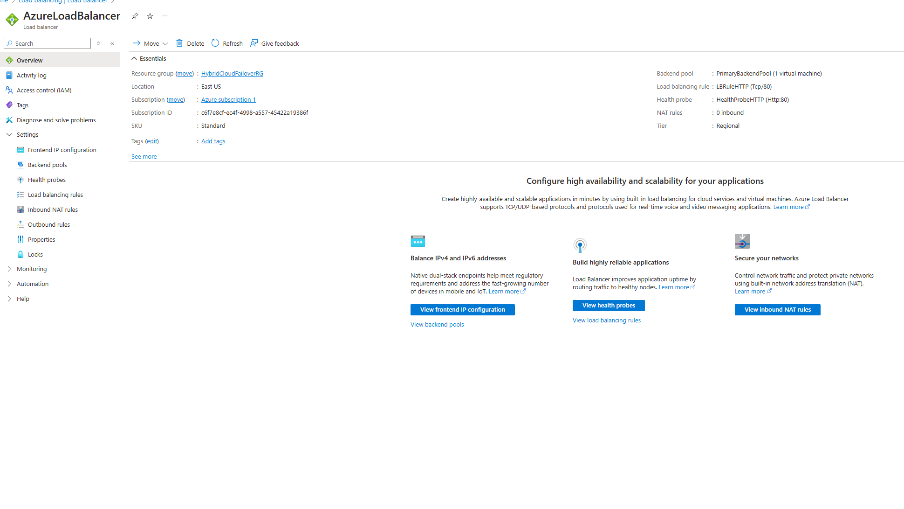
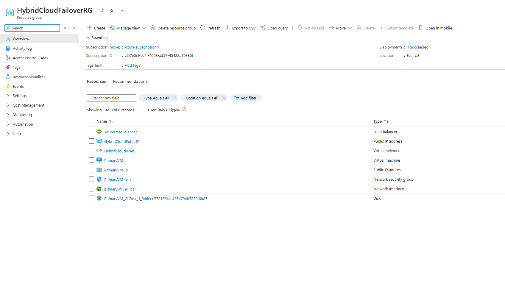
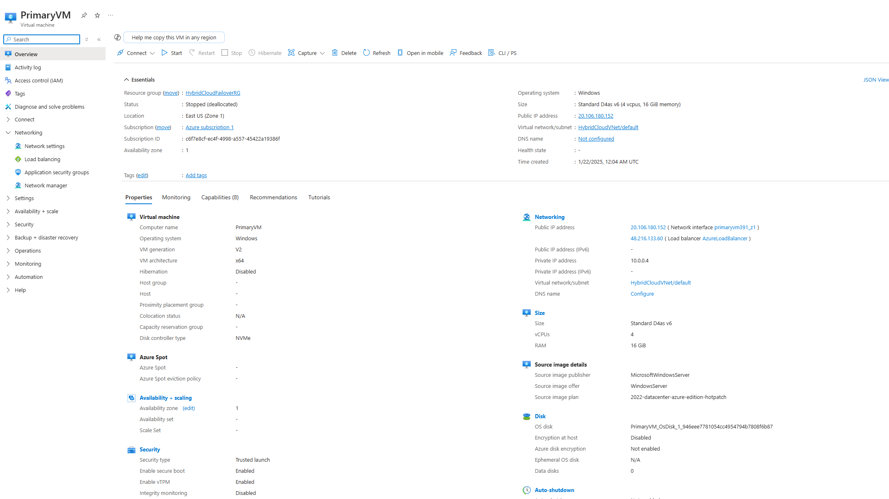
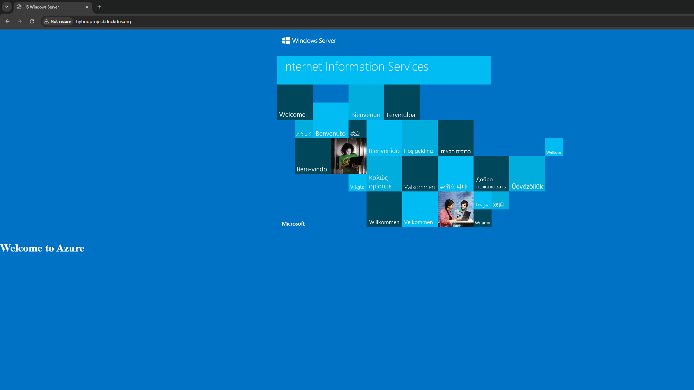
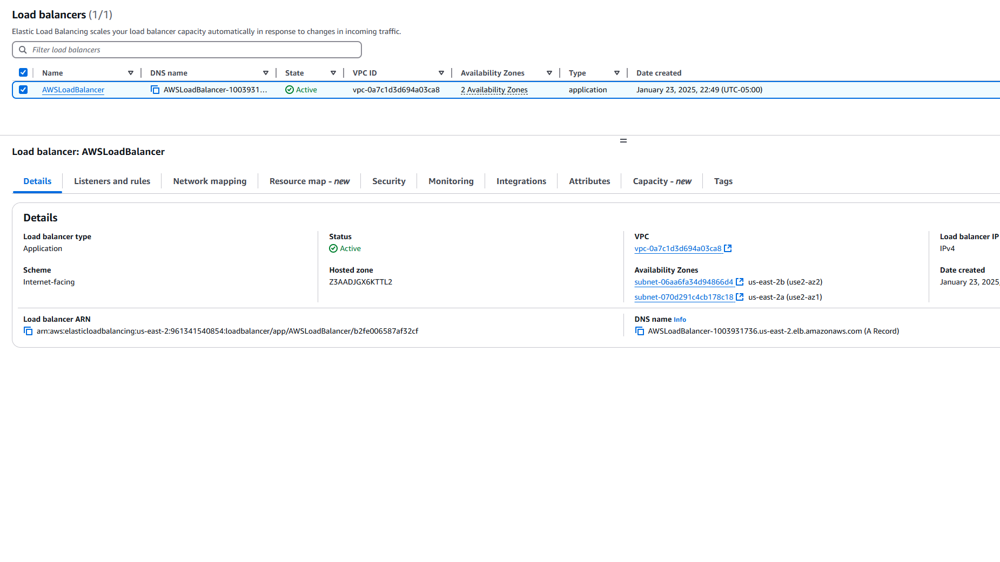
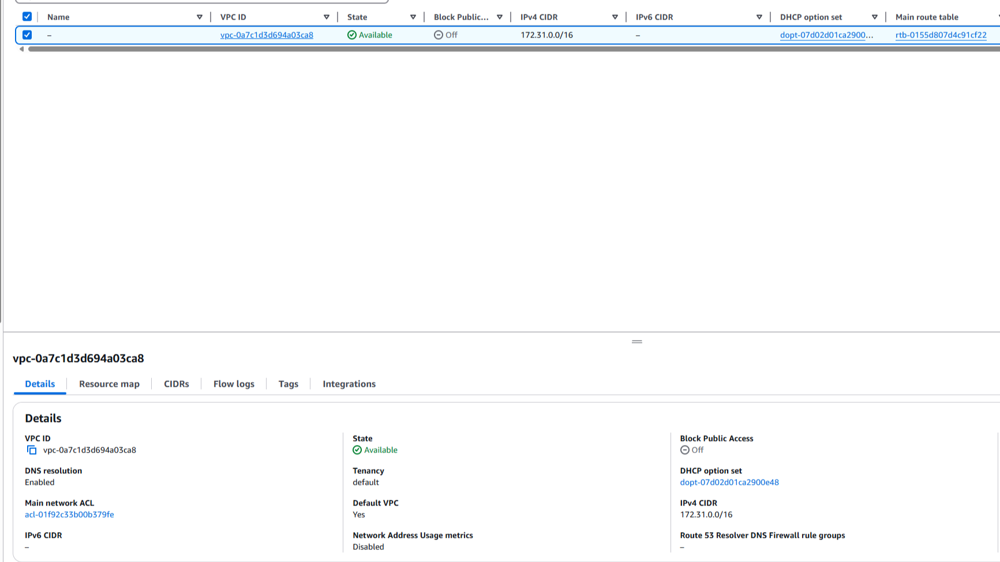
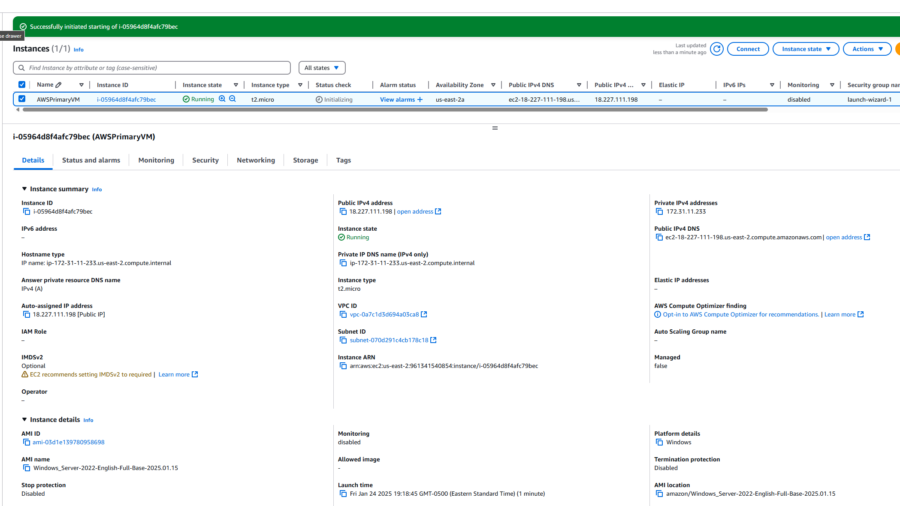
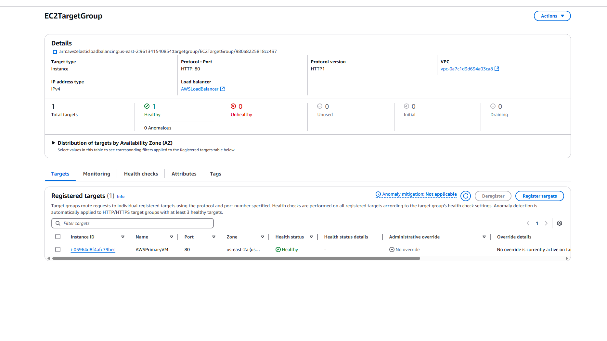
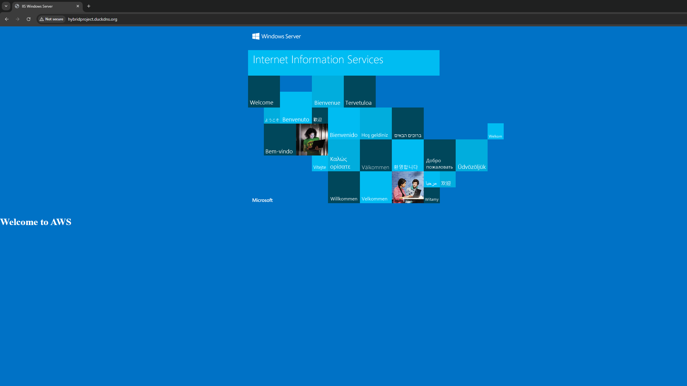

# 🌐 Hybrid Cloud Failover: Azure and AWS

This project demonstrates a hybrid cloud failover solution using Azure and AWS. It ensures business continuity and redundancy through DNS-based traffic redirection, leveraging dynamic DNS, cloud load balancers, and web servers.

---

## **Project Summary**

- **🔎 Objective**:  
  Implement a hybrid cloud environment with failover between Azure and AWS to maintain high availability and reliability during outages.

- **🛠️ Environments Used**:  
  - **Azure**:  
    - Resource Group, Virtual Machine, Load Balancer.  
  - **AWS**:  
    - VPC, EC2 Instance, Application Load Balancer.

- **💡 Technologies/Services**:  
  - **DuckDNS**: Dynamic DNS for traffic management.  
  - **IIS**: Web server for hosting pages.  
  - **Load Balancers**: Azure and AWS for traffic routing and failover.

---

## **Screenshots and Demonstration** 📸

### **Azure Environment**

**Configuration details of the Azure Load Balancer.**  

**Overview of all Azure resources.**  

**Azure VM details, including public IP and network configuration.**  

**DuckDNS subdomain pointing to Azure, showing IIS page with \"Welcome to Azure.\"**  

---

### **AWS Environment**

**Configuration details of the AWS Application Load Balancer.**  

**VPC details, including CIDR block and subnets.**  

**EC2 instance details, including public IP and instance configuration.**  

**Target group with EC2 instance marked as healthy.**  

**DuckDNS subdomain pointing to AWS, showing IIS page with \"Welcome to AWS.\"**  

---

## **Implementation Steps** 🎬

### **Azure Setup** ⚡
1. Created a Resource Group.
2. Provisioned a Virtual Network and a Windows Server Virtual Machine.
3. Configured an Azure Load Balancer with backend pools, health probes, and load balancing rules.
4. Customized the IIS default page to display "Welcome to Azure."

### **AWS Setup** 🌟
1. Created a VPC with appropriate subnets.
2. Provisioned a Windows Server EC2 instance.
3. Configured an AWS Application Load Balancer with a target group.
4. Customized the IIS default page to display "Welcome to AWS."

### **Failover Testing** 🔁
1. Updated the DuckDNS subdomain to point to Azure.
2. Confirmed that "Welcome to Azure" is displayed.
3. Updated the DuckDNS subdomain to point to AWS.
4. Confirmed that "Welcome to AWS" is displayed.

---

## **Key Takeaways** 🎯

- **Azure**:  
  - Configured a Load Balancer for traffic distribution.  
  - Hosted a web application on a Virtual Machine.

- **AWS**:  
  - Deployed an Application Load Balancer for failover support.  
  - Hosted a backup web server on an EC2 instance.

- **DuckDNS**:  
  - Managed traffic redirection dynamically between Azure and AWS.

---

## **Conclusion**

This project demonstrates a robust hybrid cloud failover strategy. It uses DuckDNS for dynamic DNS and Azure and AWS load balancers to maintain seamless traffic routing during failovers, ensuring high availability and business continuity. Future enhancements could include automating the failover process using scripts or integrating monitoring tools like Azure Monitor or AWS CloudWatch for real-time alerts.
